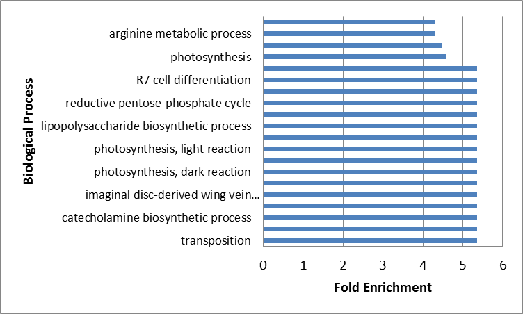

#The Geoduck Transcritome
Anaid Saavedra 

___________________________

Sequences file of Geoduck Female [Link](https://github.com/sr320/course-btea/blob/master/analyses/GeoF-Annotation-SP-join-F-M-match.csv)

Whith this information:
remove duplicates
classified as common both sex but only female gene expression was analyzed whith David Bioinformatic data base.

Annotation Summary Results

Gene Ontology. Functional Annotation Chart

More abundation Fold Enrichmente (>3) in Female

Biological process whith high expression

Female genes associate whith biological process

